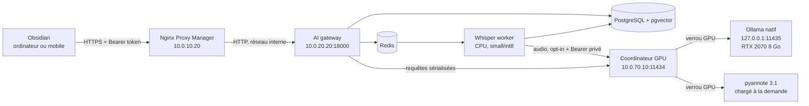

# Déploiement sur le homelab

Ce document décrit la cible du homelab Kavalek et sa procédure de mise à jour
progressive. Sauvegarder les données et valider chaque étape avant de passer à la
suivante.

## Architecture cible



La stack dédiée est [infra/docker-compose.homelab.yml](../infra/docker-compose.homelab.yml).
Elle ne déploie ni Ollama ni un reverse proxy : elle utilise les services déjà
présents. [infra/docker-compose.gpu-services.yml](../infra/docker-compose.gpu-services.yml)
déploie séparément le coordinateur sur la VM GPU.

Seul le gateway publie un port, lié par défaut à `10.0.20.20:18000`. PostgreSQL,
Redis et le worker restent sur un réseau Docker interne. Ollama reste accessible
uniquement sur les réseaux privés et ne doit jamais être publié par Nginx Proxy
Manager.

## Budget de ressources

La configuration est volontairement conservatrice pour ne pas saturer la RTX 2070
ni le LXC Docker :

- génération : `qwen3:8b`, seul modèle autorisé par défaut ;
- embeddings : `qwen3-embedding:0.6b`, dimension vérifiée à `1024` ;
- contexte Ollama limité à `16384` tokens ;
- un seul appel Ollama simultané pour partager proprement le GPU avec Open WebUI ;
- modèle conservé cinq minutes après la dernière requête, puis libérable par Ollama ;
- transcription sur CPU avec faster-whisper `small`, calcul `int8`, deux threads et
  un worker ;
- limites Docker : gateway 1 CPU/1 Gio, worker 2 CPU/4 Gio, PostgreSQL 1 CPU/1,5 Gio,
  Redis 0,5 CPU/256 Mio.

Le choix CPU pour Whisper est intentionnel : la RTX 2070 n'est disponible que dans
la VM Ollama. La diarisation est désactivée par défaut dans le plugin. Lorsqu'elle
est demandée, le coordinateur décharge Ollama, prend un verrou GPU exclusif, charge
pyannote, puis libère immédiatement modèle et cache CUDA.

## Images et GitOps

Le workflow [`.github/workflows/ci-images.yml`](../.github/workflows/ci-images.yml)
teste le plugin et les trois services Python. Après intégration sur `main`, il
construit et publie :

- `ghcr.io/antoroute/obsidian-local-ai-platform-ai-gateway:main` ;
- `ghcr.io/antoroute/obsidian-local-ai-platform-whisper-worker:main`.
- `ghcr.io/antoroute/obsidian-local-ai-platform-diarization-service:main`.

Chaque image reçoit également un tag immuable `sha-...`. La stack utilise `main`
pour les mises à jour automatiques ; un tag SHA peut être utilisé pour revenir à
une version précise.

Le dépôt étant privé, Portainer aura besoin de deux accès distincts :

1. des identifiants GitHub pour lire le dépôt Git et le fichier Compose ;
2. un identifiant de registre GHCR en lecture seule. GitHub Packages demande un
   personal access token classique avec uniquement `read:packages` pour une image
   privée. Une autre solution est de rendre uniquement les packages d'images
   publics, sans rendre le dépôt public.

Le token de développement utilisé pour pousser le code ne doit pas être réutilisé
comme secret permanent de Portainer.

Pour un bootstrap sans identifiant GHCR permanent, construire les images localement
et ajouter [infra/docker-compose.homelab.local-images.yml](../infra/docker-compose.homelab.local-images.yml)
à toutes les commandes Compose. Cet override interdit explicitement les pulls ; il
ne doit être retiré qu'après configuration du registre GHCR en lecture seule.

## Variables Portainer

Copier les clés de [`.env.homelab.example`](../.env.homelab.example) dans
l'environnement de la stack et remplacer au minimum `POSTGRES_PASSWORD`. Utiliser
un secret long et compatible avec une URL, par exemple uniquement des lettres,
chiffres, `_` et `-`, puisqu'il est injecté dans l'URL SQLAlchemy.

Ne jamais committer le fichier réel. Avant le déploiement, vérifier notamment :

- `GATEWAY_BIND_ADDRESS=10.0.20.20` ;
- `OLLAMA_BASE_URL=http://10.0.70.10:11434` ;
- `DEFAULT_MODEL` et `ALLOWED_MODELS` limités à `qwen3:8b` ;
- `RAG_EMBEDDING_MODEL=qwen3-embedding:0.6b` ;
- `RAG_EMBEDDING_DIMENSION=1024` ;
- `OLLAMA_MAX_CONCURRENT_REQUESTS=1` ;
- `USAGE_QUOTAS_ENABLED=true` ;
- `DAILY_LLM_REQUESTS_PER_USER=100` ;
- `DAILY_EMBEDDING_REQUESTS_PER_USER=5000` ;
- `DAILY_AUDIO_JOBS_PER_USER=20` ;
- `MAX_ACTIVE_AUDIO_JOBS_PER_USER=1` ;
- `WHISPER_MODEL_SIZE=small` ;
- deux secrets distincts et aléatoires dans `METRICS_TOKEN` et
  `DIARIZATION_SERVICE_TOKEN` ;
- le même `DIARIZATION_SERVICE_TOKEN` sur le worker et le coordinateur GPU.

## Coordinateur GPU et diarisation

La VM `10.0.70.10` exécute Ollama nativement sur `127.0.0.1:11435` et le
coordinateur dans Docker avec `network_mode: host` sur `10.0.70.10:11434`. Tous les
consommateurs conservent l'URL historique : le proxy transparent couvre donc Open
WebUI et Hermes sans ouvrir un nouveau flux OPNsense. Seul le coordinateur peut
joindre le port loopback d'Ollama. TCP/11434 reste limité par les pare-feux
existants et ne doit jamais être publié sur Internet.

Le modèle par défaut reste `pyannote/speaker-diarization-3.1`. Il est plus prudent
sur une RTX 2070 8 Go que Community-1 avec les versions actuelles de pyannote. Son
téléchargement nécessite un compte Hugging Face, l'acceptation des conditions du
modèle et un token en lecture. Le secret n'est utilisé que pour le préchargement.

```bash
docker compose --env-file .env.gpu \
  -f infra/docker-compose.gpu-services.yml build gpu-coordinator
docker compose --env-file .env.gpu \
  -f infra/docker-compose.gpu-services.yml up -d gpu-coordinator
```

Avant d'activer l'option dans Obsidian, mesurer sur un extrait représentatif de 5 à
10 minutes, puis sur une réunion longue : pic VRAM (`nvidia-smi`), mémoire de la VM,
temps réel, changements de locuteur erronés et retour d'Ollama après le traitement.
Si la mémoire dépasse le budget ou si le gain est faible, conserver la diarisation
désactivée ; la transcription CPU et le compte rendu continuent de fonctionner.

Les libellés `Speaker 1`, `Speaker 2`, etc. sont anonymes. Leur correspondance avec
les participants doit être confirmée manuellement ; le système ne fait ni
reconnaissance vocale biométrique ni identification de personnes.

## Préparation initiale du modèle Whisper

Le worker normal fonctionne avec `HF_HUB_OFFLINE=1` et n'a pas de sortie Internet.
Le téléchargement initial est isolé dans le service à usage unique
`whisper-model-preparer`, placé sous le profil Compose `prepare-model`.

Sur l'hôte Docker, depuis une copie du dépôt et avec le fichier d'environnement
réel :

```bash
docker compose \
  --env-file .env.homelab \
  -f infra/docker-compose.homelab.yml \
  --profile prepare-model \
  run --rm whisper-model-preparer
```

Cette opération remplit uniquement le volume `obsidian-ai-whisper-models`. Une fois
terminée, le service de préparation disparaît et le worker reste hors ligne. Cette
étape sera exécutée pendant la phase 3 avant d'activer la transcription.

## Cible Nginx Proxy Manager

La cible proposée est `obsidian-ai.kavalek.fr` :

- certificat TLS Let's Encrypt ;
- destination `http://10.0.20.20:18000` ;
- `Force SSL`, HTTP/2, HSTS et `Block Common Exploits` activés ;
- aucun port PostgreSQL, Redis, Ollama ou worker exposé ;
- pas de liste blanche par IP, afin que les appareils nomades puissent se connecter ;
- authentification applicative obligatoire par Bearer token sur toutes les routes,
  sauf `/v1/health`.

L'enregistrement audio dépasse la limite Nginx par défaut. La configuration avancée
du proxy host devra contenir au minimum :

```nginx
client_max_body_size 260m;
proxy_read_timeout 3600s;
proxy_send_timeout 3600s;
limit_req zone=obsidian_ai_api burst=60 nodelay;
limit_req_status 429;
limit_conn obsidian_ai_conn 4;
limit_conn_status 429;
```

La valeur reste légèrement supérieure à `MAX_AUDIO_UPLOAD_MB=250`, afin que
l'application conserve la décision finale d'accepter ou de refuser le fichier.
Les zones Nginx correspondantes utilisent `120r/m` par adresse IP et quatre
connexions simultanées. Les quotas applicatifs par utilisateur restent la seconde
barrière et protègent les appareils partageant une même adresse publique.

Le port `18000` est filtré dans `DOCKER-USER` : seuls NPM `10.0.10.20` et l'hôte
Docker lui-même sont autorisés. Le proxy host NPM 84, HSTS, le DNS public OVH et le
retour `401` sans token ont été validés le 13 août 2026.

## Phase 3 appliquée

Le déploiement réel utilise l'Ollama existant sur `10.0.70.10`, PostgreSQL/pgvector
et Redis internes, Whisper `small` CPU/int8 avec un seul worker, et le seul port
publié `10.0.20.20:18000`. Les tests fonctionnels couvrent authentification,
résumé, assistant, réunions, RAG et transcription audio réelle.

GHCR reste privé. Tant qu'un jeton classique dédié `read:packages` n'est pas ajouté
à Portainer, le serveur utilise l'override d'images locales avec
`pull_policy: never`. Cette limite n'affecte pas l'exécution courante.

Les migrations Alembic sont exécutées par le conteneur gateway avant Uvicorn. Avant
une mise à jour, sauvegarder PostgreSQL et noter les tags d'images courants. Après
redéploiement, vérifier `/v1/health`, l'endpoint authentifié `/v1/health/ready`, le
heartbeat worker, un petit fichier audio et une requête RAG.

Prometheus interroge `/metrics` avec le Bearer `METRICS_TOKEN`. Le dashboard public
ne doit jamais contenir ce secret : il s'appuie sur la supervision interne pour
afficher la disponibilité du gateway, du worker, de PostgreSQL, Redis, du véritable
serveur Ollama et du coordinateur GPU.

## Retour arrière et données

Les volumes ont des noms stables :

- `obsidian-ai-postgres` ;
- `obsidian-ai-redis` ;
- `obsidian-ai-audio` ;
- `obsidian-ai-whisper-models`.

Un retour arrière applicatif consiste à remplacer les trois tags `main` par les tags
SHA connus et à redéployer. Il ne faut pas supprimer les volumes. PostgreSQL et les
fichiers audio devront être intégrés aux sauvegardes avant la mise en production.
